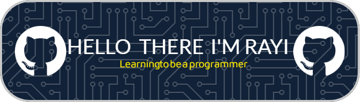

# Halo Semuanya Saya Rayi

_Seorang siswa SMK N 4 KENDAL yang belajar menjadi pengembang yang penuh semangat dan antusias teknologi_

---

---

## Tentang

Selamat datang di proyek saya! Repositori ini berisi karya dan eksperimen saya dalam pengembangan perangkat lunak. Silakan jelajahi dan hubungi saya jika ada pertanyaan.

---

## Kontak

Mari berinteraksi dengan saya di

   

---

## Skills

Berikut adalah beberapa keterampilan dan teknologi yang saya kuasai:

- Pemrograman:JavaScript, C++
- Pengembangan Web: HTML, CSS, React, Node.js
- Basis Data: MySQL, MongoDB
- Alat & Lainnya: Git, Docker, Linux

      

## Stats Github Saya
